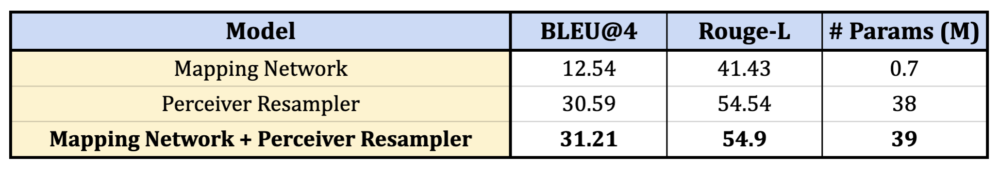
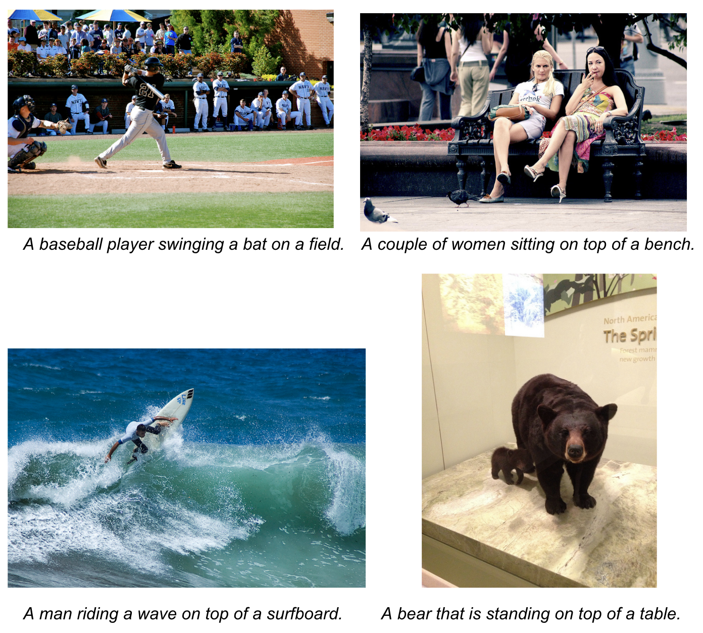

# Perceiver-Resampler-XAttn-Captioning

In this project, we demonstrate the ability to describe images in natural languages by employing the few-shot cross-domain applicability of the large vision and language models such as [CLIP](https://openai.com/blog/clip/) and [GPT2](https://openai.com/blog/better-language-models/) respectively. Specifically, we show that using a pre-trained image encoder along with a text generator can work right out-of-the-box for image caption generation tasks *provided we are able to devise an effective way to tune the image encoder outputs to conform to the text generator weights*. We approach this problem by introducting a **perceiver-resampler network with gated cross attention layers** and a **mapping network** between the frozen encoder and the frozen generator.

We provide more details on the model architecture as well as how to setup and run the project in the sections below.

## Dependencies

Install all the project dependencies with

```
$ pip install -r requirements.txt
```

## Model Architecture

Our model architecture consists of three parts: a pre-trained image encoder, a pre-trained text generator and a *bridge to connect the encoder with the generator*. For the image encoder, we use a pre-trained [ViT-based CLIP vision model](https://huggingface.co/docs/transformers/model_doc/clip) and for the text generator, we use a pre-trained [GPT2](https://huggingface.co/docs/transformers/model_doc/gpt2). The bridge consists of two sub-parts: a perceiver resampler network with gated cross-attention to provide additional visual context to the GPT2 layers and a mapper network to tune the CLIP outputs to conform to the weights of GPT2.

For more in-depth details of the architecture like the structure of the perceiver-resampler network, the gated cross-attention layers, the mapper network and how to feed the image embeddings to these structures, please checkout the [README](model/README.md) in the `model/` directory.

<div align="center">
  
</div>

## Results

The model with the perceiver-resampler network and the MLP mapper network enabled, achieves a BLEU4 score of **31.21** on the COCO validation set. All the results shown below are for the models trained with the default set of hyperparameters present in `config.yaml` with the exception of `enable_resampler_xattn=False` for the Mapping Network row and `enable_mapper=False` for the Perceiver-Resampler row.

<div align="center">
  
</div>

The **Mapping Network + Perceiver Resampler** model generates high quality descriptions of images in natural language. Some generated samples are shown below.

<div align="center">
  
</div>

## Dataset

The training scripts and the model architecture can support can image-to-text and video-to-text tasks right out of the box. What needs to be changed is the dataset class in `dataset.py` to support your own dataset. However, the current codebase offers the code to create data loaders only for the MSCOCO and the MLSLT (Multiligual Sign-Language Translation) dataset.

For instructions on how to download and setup the dataset, check the [README](data/README.md) in the `data/` directory.

## Training

For training a model with the hyperparamters present in `config.yaml`, run

```
$ python run.py \
    --config-path=<Directory containing the config file> \
    --config-name=config.yaml \
    name=<name of the experiment> \
    mode=train \
    dataset.train_ds.visual_dir=<Directory containing the videos or images for train set> \
    dataset.train_ds.json_path=<Path to the json file with the transcripts for train set> \
    dataset.validation_ds.visual_dir=<Directory containing the videos or images for validation set> \
    dataset.validation_ds.json_path=<Path to the json file with the transcripts for validation set> \
    trainer.exp_dir=<Directory to save the checkpoints and logs>
```

## Evaluation

After training, you can use the command below to evaluate your models.

Don't feel like training a model yet? No worries, you can download a checkpoint that we trained using the default configuration present in `config.yaml` from [here](https://drive.google.com/file/d/11dYzjLq3nHtG0I_FP49YfztK0FOzbuca/view?usp=sharing).

To evaluate on the test set, run

```
HYDRA_FULL_ERROR=1 python run.py \
    --config-path=<Directory containing the config file> \
    --config-name=config.yaml \
    name=<name of the experiment> \
    mode=test \
    pretrained_name=<path to the checkpoint> \
    dataset.test_ds.visual_dir=<Directory containing the videos or images for test set> \
    dataset.test_ds.json_path=<Path to the json file with the transcripts for test set> \
    trainer.exp_dir=<Directory to save the logs>
```

*NOTE: The commands given above train or evaluate the model based on the default set of hyperparameters given in `config.yaml`. To tweak those values, please specify them explicitly via the command line.*

## Contact/Getting Help

If you need any help or want to report a bug, feel free to raise an issue in the repo.
