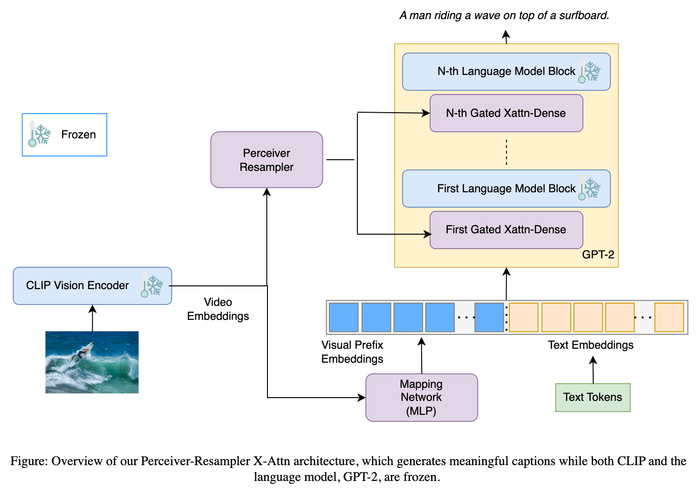
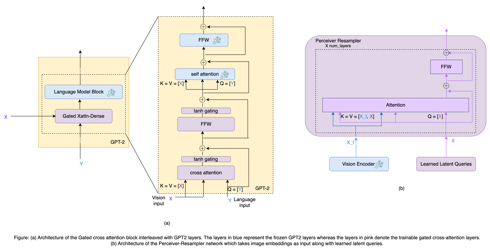

# Model Architecture

The model architecture consists  of three parts:
- Pre-trained image encoder
- Pre-trained text generator
- Perceiver-resampler with gated cross-attention and mapping network to connect the encoder with the generator.

<p style="text-align:center;">

</p>

The image encoder utilizes pre-trained ViT-based vision model from [CLIP](https://huggingface.co/docs/transformers/model_doc/clip), and similarly, the text generator consists of a pre-trained [GPT2](https://huggingface.co/docs/transformers/model_doc/gpt2) model. Note that, throughtout the training phase, the image encoder and the text generator remain frozen. To connect the image and text modalities we employ a bridge to provide additional visual context to GPT2 and tune the CLIP outputs to conform to the weights of GPT2.

The bridge comprises two sub-parts:
- Mapping network
- Perceiver-resampler network with gated cross attention

## Perceiver Resampler

Using the visual encoder of a pre-trained CLIP model, we extract image embeddings which are then fed to both the perceiver-resampler and the mapping network. The perceiver-resampler produces a fixed number of visual tokens which are fed to the gated cross-attention layers. These gated cross-attention layers are interleaved with frozen layers of GPT2 in a residual fashion.

<p style="text-align:center;">

</p>

## Mapping Network

The mapper network translates the CLIP embeddings to the GPT2 space reducing the gap between the visual and textual worlds. This can take two configurations, a Transformer mapper and a two-layer Multi-Layer Perceptron (MLP). The network generates a visual prefix, which is then concatenated with the token embeddings of the ground truth caption. This is fed to the GPT2 language model which predicts caption in an autoregressive manner.

## Model Summary

Below we show a summary of the entore model architecture generated using the default set of hyperparameters present in `config.yaml`.

```
===============================================================================================
Layer (type:depth-idx)                                                 Param #
===============================================================================================
VisualTextModel                                                        --
├─VisionEncoder: 1-1                                                   --
│    └─CLIPVisionModel: 2-1                                            --
│    │    └─CLIPVisionTransformer: 3-1                                 (87,456,000)
├─Mapper: 1-2                                                          --
│    └─Sequential: 2-2                                                 --
│    │    └─Linear: 3-2                                                393,728
│    │    └─Tanh: 3-3                                                  --
│    │    └─Linear: 3-4                                                393,984
├─PerceiverResampler: 1-3                                              433,152
│    └─ModuleList: 2-3                                                 --
│    │    └─ModuleList: 3-5                                            2,363,904
│    │    └─ModuleList: 3-6                                            2,363,904
│    │    └─ModuleList: 3-7                                            2,363,904
│    │    └─ModuleList: 3-8                                            2,363,904
│    └─LayerNorm: 2-4                                                  1,536
├─TextGenerator: 1-4                                                   --
│    └─GPT2LMHeadModel: 2-5                                            --
│    │    └─GPT2Model: 3-9                                             152,788,248
│    │    └─Linear: 3-10                                               (38,597,376)
===============================================================================================
Total params: 250,922,264
Trainable params: 39,026,456
Non-trainable params: 211,895,808
===============================================================================================
```
